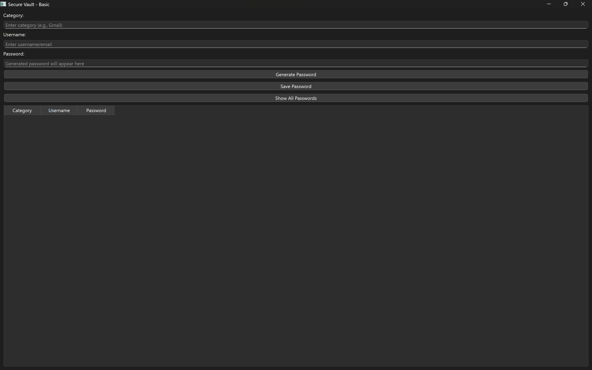
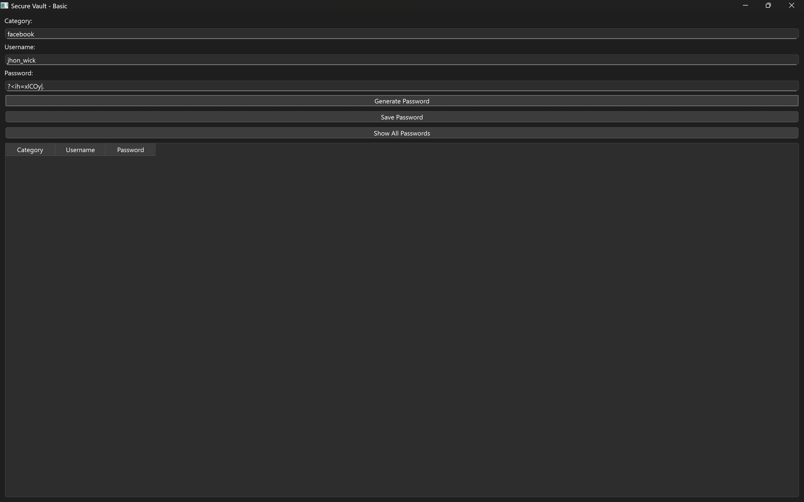
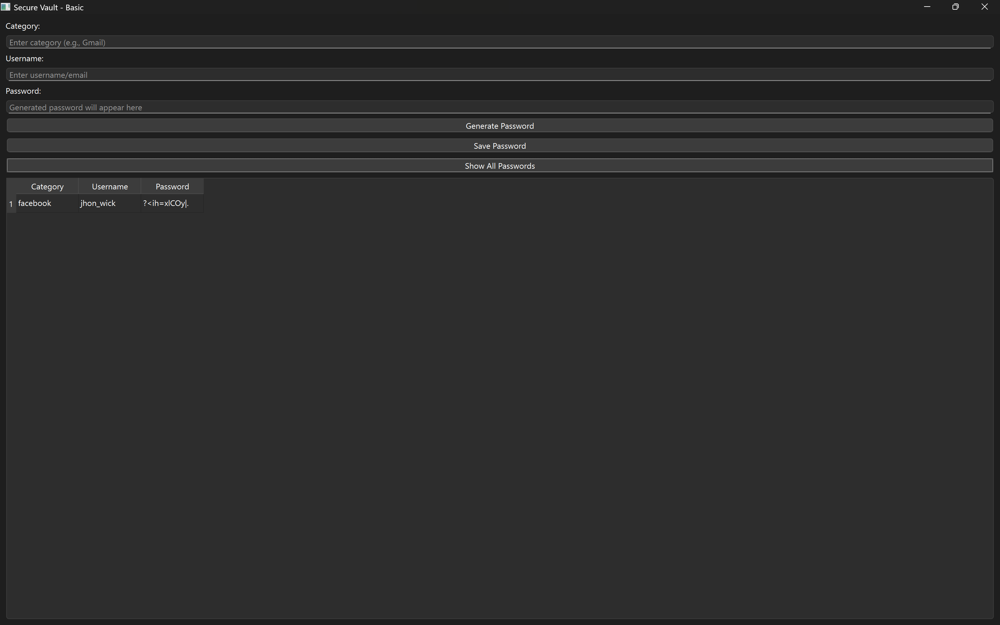

# 🔐 SecureVault – Password Generator & Manager

SecureVault is a simple yet powerful **Password Generator & Password Manager combo** built with **Python** and **PySide6 (Qt for Python)**.  
It allows you to **generate strong passwords** and **store them securely** by category (e.g., Social, Banking, Work).

---

## ✨ Features

- ✅ Generate strong random passwords   
- ✅ Save and manage passwords by category/application  
- ✅ View saved passwords in a table view  
- ✅ SQLite database storage (`data/passwords.db`)  
- ✅ User-friendly interface built with **PySide6**  
- ✅ 100% local (no internet dependency)  

---

## 📂 Project Structure

```
secure_vault/
│
├── main.py                   # Entry point of the app
│
├── core/                     # Backend logic
│   ├── __init__.py
│   ├── password_generator.py # Password generation logic
│   └── password_manager.py   # Database (SQLite) functions
│
├── ui/                       # User Interface
│   ├── __init__.py
│   └── main_window.py        # Main application window
│
└── data/
    └── passwords.db          # Local SQLite database
```

---

## ⚙️ Installation & Setup

### 1. Clone the repository
```bash
git clone https://github.com/badiwalharsh/secure-vault.git
cd secure-vault
```

### 2. Create a virtual environment (recommended)
```bash
python -m venv venv
source venv/bin/activate   # On Linux/Mac
venv\Scripts\activate      # On Windows
```

### 3. Install dependencies
```bash
pip install PySide6
```

### 4. Run the app
```bash
python main.py
```

---

## 🖥️ Usage

1. Start the application.  
2. Generate a new password or add your own.  
3. Save it with an **application name** (e.g., Gmail, Facebook, Bank).  
4. Manage and view your stored passwords in the table.  

---

## 📸 Screenshots

| Main Window | Generate Password | Saved Passwords |
|-------------|-------------------|-----------------|
|  |  |  |

---

## 🚀 Future Enhancements

- Password search & filter  
- Copy password to clipboard  
- Master password authentication  
- Export/Import database with encryption  

---

## 📜 License

This project is licensed under the **MIT License** – feel free to use and modify.  
